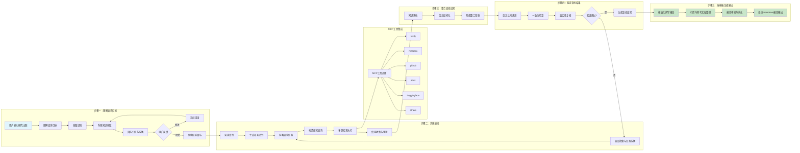

```mermaid
flowchart LR

    subgraph "步骤一：理解查询目标"
        direction TB
        A[用户输入研究主题] --> B[理解查询目标]
        B --> C[意图识别]
        C --> D[背景知识获取]
        D --> E[目标分析与拆解]
        E --> F{用户反馈}
        F -->|修改| G[追问澄清]
        G --> D
        F -->|接受| H[明确研究目标]
    end

    H --> I[实施查找]

    subgraph "步骤二：实施查找"
        direction TB
        I --> J[生成研究计划]
        J --> K[拆解查询任务]
        K --> L[构造搜索查询]
        L --> M[多源检索执行]
        M --> N[信息收集与整理]
        Rework[返回检索与任务拆解]
        Rework --> K
    end

    M --> T0[MCP工具调用]

    subgraph "MCP工具集成"
        direction TB
        T0 --> T1[tavily]
        T0 --> T2[metasou]
        T0 --> T3[github]
        T0 --> T4[arxiv]
        T0 --> T5[huggingface]
        T0 --> T6[others]
    end

    N --> O[知识评估]

    subgraph "步骤三：整合查找结果"
        direction TB
        O --> P[信息结构化]
        P --> Q[形成整合草稿]
    end

    subgraph "步骤四：验证查找结果"
        direction TB
        Q --> R[交叉比对来源]
        R --> S[一致性检查]
        S --> T[真实性复核]
        T --> U{验证通过?}
        U -->|否| Rework
        U -->|是| V[生成查找结果]
    end

    subgraph "步骤五：按模板生成输出"
        direction TB
        V --> W[模板化撰写报告]
        W --> X[引用与参考文献整理]
        X --> Y[报告审核与优化]
        Y --> Z[最终markdown报告输出]
    end

    style A fill:#e1f5fe
    style W fill:#c8e6c9
    style X fill:#c8e6c9
    style Y fill:#c8e6c9
    style Z fill:#c8e6c9
```
